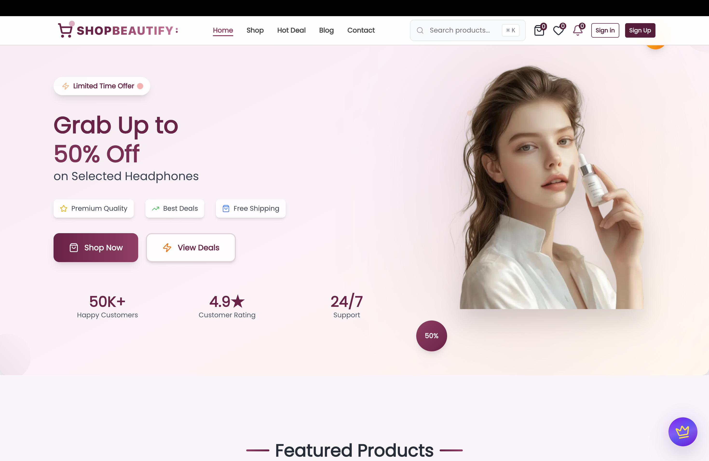

# 🛒 Shop Skincare Pro - Complete E-Commerce Solution

[](https://nextjs.org/)
[](https://react.dev/)
[](https://www.typescriptlang.org/)
[](https://tailwindcss.com/)

A modern, feature-rich e-commerce application built with Next.js 16, TypeScript CMS. This free version includes core e-commerce features with premium features available in the paid version.



## ✨ Features

### 🎯 Core Features (Free)

- 🛍️ **Product Management** - Complete product catalog with categories, brands, and search
- 🛒 **Shopping Cart** - Persistent cart with real-time updates
- 💝 **Wishlist** - Save favorite products for later
- 📦 **Order Management** - Track orders and order history
- 📱 **Responsive Design** - Mobile-first responsive UI
- 🎨 **Modern UI/UX** - Built with Tailwind CSS and Framer Motion
- 🔍 **Advanced Search & Filters** - Filter by category, brand, price, and more
- ⭐ **Product Reviews** - Customer reviews and ratings
- 📧 **Email Notifications** - Order confirmations and updates via Nodemailer

### 👑 Premium Features (Paid Version)

- 📊 **Advanced Analytics Dashboard** - Comprehensive business insights
- 👥 **Employee Management System** - Multi-role employee portal
- 📝 **Review Management Tools** - Moderate and manage customer reviews
- 📬 **Subscription Management** - Newsletter and email campaigns
- 📈 **Customer Insights & Reports** - Detailed customer analytics
- 📥 **Export Data to Excel/CSV** - Export all data for analysis
- 🎨 **Custom Admin Branding** - Customize admin panel
- 🚀 **Priority Support & Updates** - Fast support and early access to features


---

## 🚀 Quick Start Guide

### Prerequisites

Before you begin, ensure you have the following installed:

- **Node.js** 18.0 or higher ([Download](https://nodejs.org/))
- **npm**, **yarn**, or **pnpm** package manager
- **Git** ([Download](https://git-scm.com/))

---

## 📋 Step-by-Step Setup

### 1️⃣ Clone the Repository

```bash
git clone https://github.com/khuongtran02052001/e-commerce-2026
cd shopskincare
```

### 2️⃣ Install Dependencies

Choose your preferred package manager:

```bash
# Using npm
npm install

# Using yarn
yarn install

# Using pnpm (recommended)
pnpm install
```

### 3️⃣ Set Up Environment Variables

Create a `.env` file in the root directory and add the following variables:

```bash
# Base URL
NEXT_PUBLIC_BASE_URL=http://localhost:3000

# Email Configuration (Nodemailer)
EMAIL_USER=your_email@gmail.com
EMAIL_PASSWORD=your_app_password

# Admin Configuration
NEXT_PUBLIC_ADMIN_EMAIL=admin@yourdomain.com

# Premium Version Link (Optional)

# Company Information (Optional)
NEXT_PUBLIC_COMPANY_NAME=ShopCart
NEXT_PUBLIC_COMPANY_EMAIL=support@shopcart.com
NEXT_PUBLIC_COMPANY_PHONE=+1 (555) 123-4567
NEXT_PUBLIC_COMPANY_ADDRESS=123 Business Street
NEXT_PUBLIC_COMPANY_CITY=New York, NY 10001, USA
```

---

### Development Mode

Start the development server with Turbopack (faster):

```bash
# Using npm
npm run dev

# Using yarn
yarn dev

# Using pnpm
pnpm dev
```

The application will be available at:

- **Frontend**: [http://localhost:3000](http://localhost:3000)

### Production Build

```bash
# Build the application
npm run build

# Start the production server
npm start
```

---

## 📁 Project Structure

```
shopskincare/
├── app/                           # Next.js 16 App Router
│   ├── (admin)/                  # Admin Panel Routes
│   │   └── admin/
│   │       ├── page.tsx          # Admin Dashboard (Premium) ⭐
│   │       ├── layout.tsx        # Admin layout with navigation
│   │       ├── analytics/        # Analytics Dashboard (Premium) ⭐
│   │       ├── reviews/          # Review Management (Premium) ⭐
│   │       ├── subscriptions/    # Subscription Management (Premium) ⭐
│   │       ├── employees/        # Employee Management
│   │       ├── products/         # Product Management
│   │       ├── orders/           # Order Management
│   │       ├── users/            # User Management
│   │       ├── account-requests/ # Account Requests
│   │       ├── notifications/    # Notification Center
│   │       └── access-denied/    # Access Denied Page
│   │
│   ├── (auth)/                   # Authentication Routes
│   │   ├── sign-in/
│   │   │   └── [[...sign-in]]/ 
│   │   └── sign-up/
│   │       └── [[...sign-up]]/ 
│   │
│   ├── (client)/                 # Client-Facing Routes
│   │   ├── page.tsx             # Home Page
│   │   ├── layout.tsx           # Client layout with header/footer
│   │   ├── shop/                # Shop All Products
│   │   ├── category/
│   │   │   ├── page.tsx         # All Categories
│   │   │   └── [slug]/          # Category Detail Page
│   │   ├── product/
│   │   │   ├── page.tsx         # All Products
│   │   │   └── [slug]/          # Product Detail Page
│   │   ├── brands/
│   │   │   ├── page.tsx         # All Brands
│   │   │   └── [slug]/          # Brand Detail Page
│   │   ├── blog/
│   │   │   ├── page.tsx         # All Blog Posts
│   │   │   └── [slug]/          # Blog Post Detail
│   │   ├── deal/                # Special Deals
│   │   ├── orders/              # Order Tracking
│   │   ├── dashboard/           # User Dashboard
│   │   │
│   │   ├── (public)/            # Public Pages
│   │   │   ├── about/           # About Us
│   │   │   ├── contact/         # Contact Us
│   │   │   ├── privacy/         # Privacy Policy
│   │   │   ├── terms/           # Terms & Conditions
│   │   │   ├── faq/             # FAQ Page
│   │   │   ├── faqs/            # FAQs Alternative
│   │   │   └── help/            # Help Center
│   │   │
│   │   └── (user)/              # Protected User Routes
│   │       ├── cart/            # Shopping Cart
│   │       ├── checkout/        # Checkout Process
│   │       ├── wishlist/        # Wishlist
│   │       ├── success/         # Payment Success
│   │       └── user/
│   │           ├── page.tsx                    # User Profile
│   │           ├── dashboard/                  # User Dashboard
│   │           ├── profile/                    # Edit Profile
│   │           ├── orders/                     # Order History
│   │           │   └── [id]/                   # Order Details
│   │           ├── notifications/              # User Notifications
│   │           ├── settings/                   # Account Settings
│   │           └── admin/                      # User Admin Tools
│   │               ├── manage-users/           # Manage Users
│   │               ├── business-accounts/      # Business Accounts
│   │               └── premium-accounts/       # Premium Accounts
│   │
│   ├── (employee)/               # Employee Portal (Premium) ⭐
│   │   └── employee/
│   │       ├── page.tsx         # Shows Premium Upgrade Message
│   │       └── layout.tsx       # Employee layout (gated)
│   │
│   ├── api/                      # API Routes
│   │   ├── checkout/
│   │   │   ├── stripe/          
│   │   │   │   └── complete/    
│   │   ├── webhooks/
│   │   │   └── stripe/          
│   │   ├── orders/              # Order Management APIs
│   │   ├── products/            # Product APIs
│   │   ├── user/                # User APIs
│   │   ├── cart/                # Cart APIs
│   │   ├── wishlist/            # Wishlist APIs
│   │   ├── reviews/             # Review APIs
│   │   ├── email/               # Email Service APIs
│   │   └── notifications/       # Notification APIs
│   │
│   │
│   ├── layout.tsx               # Root Layout
│   ├── globals.css              # Global Styles
│   ├── not-found.tsx            # 404 Page
│   ├── robots.ts                # Robots.txt Generator
│   └── sitemap.ts               # Sitemap Generator
│
├── components/                   # React Components
│   ├── admin/                   # Admin Components
│   │   ├── AdminDashboardOverview.tsx
│   │   ├── AdminPremiumFeature.tsx    # Premium Message Component
│   │   ├── AdminTopNavigation.tsx
│   │   ├── AnalyticsDashboard.tsx
│   │   ├── AdminReviews.tsx
│   │   ├── AdminSubscriptions.tsx
│   │   ├── EmployeeManagement.tsx
│   │   ├── EmployeeOrderManagement.tsx
│   │   └── ...
│   │
│   ├── cart/                    # Cart Components
│   │   ├── CartItem.tsx
│   │   ├── CartSummary.tsx
│   │   └── ...
│   │
│   ├── checkout/                # Checkout Components
│   │   ├── CheckoutContent.tsx
│   │   ├── PaymentModal.tsx
│   │   ├── DirectPaymentModal.tsx
│   │   └── ...
│   │
│   ├── employee/                # Employee Components (Premium)
│   │   └── PaidFeatureMessage.tsx   # Premium Upgrade Message
│   │
│   ├── product/                 # Product Components
│   │   ├── ProductCard.tsx
│   │   ├── ProductGrid.tsx
│   │   ├── ProductDetails.tsx
│   │   ├── ProductReviews.tsx
│   │   └── ...
│   │
│   ├── profile/                 # User Profile Components
│   │   ├── ProfileForm.tsx
│   │   ├── OrderHistory.tsx
│   │   └── ...
│   │
│   ├── ui/                      # UI Components (shadcn/ui)
│   │   ├── button.tsx
│   │   ├── dialog.tsx
│   │   ├── input.tsx
│   │   ├── select.tsx
│   │   └── ...
│   │
│   ├── PremiumFloatingButton.tsx    # Premium Upgrade Button
│   ├── Header.tsx
│   ├── Footer.tsx
│   ├── Container.tsx
│   └── ...
│
├── actions/                     # Server Actions
│   ├── userActions.ts          # User-related actions
│   ├── orderActions.ts         # Order-related actions
│   ├── employeeActions.ts      # Employee actions (for admin)
│   ├── orderEmployeeActions.ts # Order employee actions
│   ├── reviewActions.ts        # Review actions
│   ├── wishlistActions.ts      # Wishlist actions
│   ├── walletActions.ts        # Wallet actions
│   ├── emailUserActions.ts     # Email actions
│   └── ...
│
├── lib/                         # Utility Functions
│   ├── adminUtils.ts           # Admin utility functions
│   ├── orderStatus.ts          # Order status management
│   ├── emailImageUtils.ts      # Email utilities
│   ├── notificationService.ts  # Notification service
│   └── ...
│
│
├── types/                       # TypeScript Definitions
│   ├── product.ts
│   ├── order.ts
│   ├── user.ts
│   ├── employee.ts
│   └── ...
│
├── hooks/                       # Custom React Hooks
│   ├── useCart.ts
│   ├── useWishlist.ts
│   ├── useOrderPlacement.ts
│   └── ...
│
├── config/                      # Configuration Files
│   └── contact.ts              # Contact information config
│
├── constants/                   # Constants
│   └── index.ts
│
├── public/                      # Static Assets
│   ├── preview.png             # App preview image
│   └── ...
│
├── .env                         # Environment Variables (git-ignored)
├── next.config.ts              # Next.js Configuration
├── tailwind.config.ts          # Tailwind CSS Configuration
├── tsconfig.json               # TypeScript Configuration
└── package.json                # Dependencies & Scripts
```

**Note**: Routes marked with ⭐ show premium upgrade messages in the free version.

---

## 🎨 Accessing Different Sections

### 🏠 Customer Frontend

- URL: [http://localhost:3000](http://localhost:3000)
- Features: Browse products, add to cart, checkout, order tracking

### 👨‍💼 Admin Panel

- URL: [http://localhost:3000/admin](http://localhost:3000/admin)
- **Default Access**: Set your email in `NEXT_PUBLIC_ADMIN_EMAIL`
- Features: Manage products, orders, users, notifications

### 👔 Employee Portal (Premium)

- URL: [http://localhost:3000/employee](http://localhost:3000/employee)
- **Note**: Shows upgrade message in free version

---

## 🛠️ Available Scripts

```bash
# Development with Turbopack
npm run dev

# Build for production
npm run build

# Start production server
npm start

# Run ESLint
npm run lint

```

---

---

## 🐛 Troubleshooting

### Common Issues

**1. Environment variables not loading**

- Restart the development server after changing `.env`
- Make sure variable names are correct (no typos)
- Check that sensitive variables don't have quotes

**2. Build errors**

```bash
# Clear Next.js cache
rm -rf .next
npm run build
```

---

## 🚀 Deployment

### Deploy to Vercel (Recommended)

1. Push your code to GitHub
2. Visit [Vercel](https://vercel.com/)
3. Import your repository
4. Add all environment variables from `.env`
5. Update `NEXT_PUBLIC_BASE_URL` to your domain
6. Deploy!

📚 [Vercel Deployment Docs](https://nextjs.org/docs/deployment)

---

## 🙏 Acknowledgments

Built with amazing open-source technologies:

- [Next.js](https://nextjs.org/)
- [React](https://react.dev/)
- [Tailwind CSS](https://tailwindcss.com/)
- [shadcn/ui](https://ui.shadcn.com/)
- [Framer Motion](https://www.framer.com/motion/)
- [Lucide Icons](https://lucide.dev/)

---

## 📈 Version

**Current Version**: 0.1.0 (Free)

**Premium Version Features**:

- 📊 Advanced Analytics
- 👥 Employee Management
- 📝 Review Management
- 📬 Subscription Tools
- 📈 Customer Insights
- 📥 Data Export
- 🎨 Custom Branding
- 🚀 Priority Support

