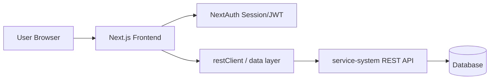
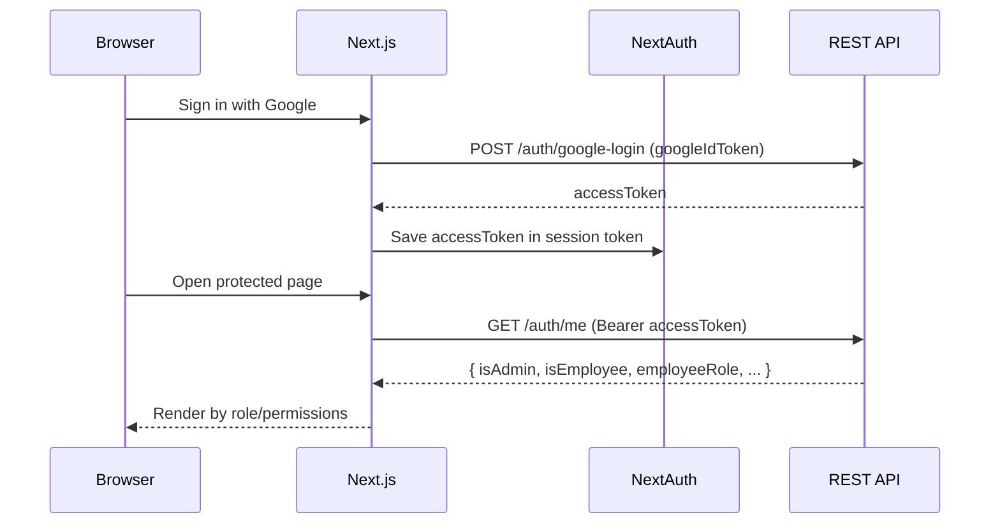
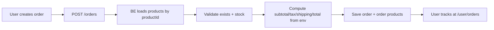
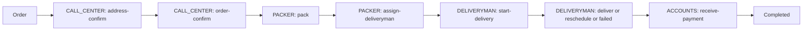
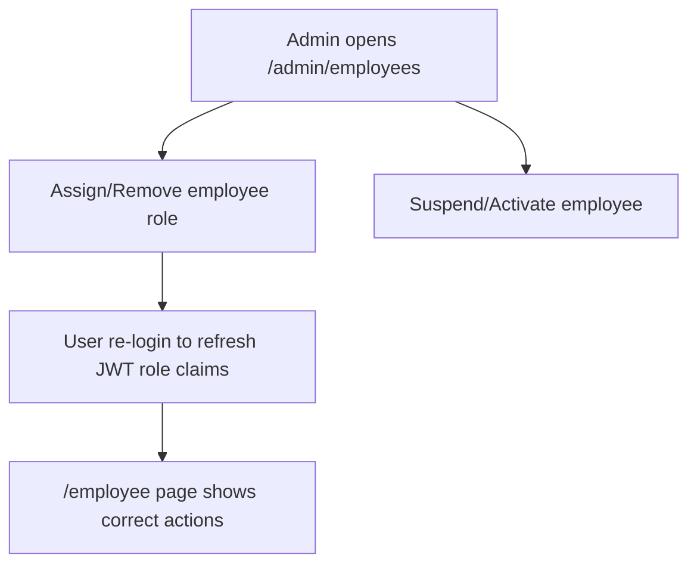

# App Full Flow (FE + BE)

Updated: 2026-03-04

Diagram file:

- [APP_FULL_FLOW.drawio](./APP_FULL_FLOW.drawio)
- Open on diagrams.net (GitHub raw):  
  [Diagram](https://viewer.diagrams.net/?tags=%7B%7D&lightbox=1&highlight=0000ff&edit=_blank&layers=1&nav=1&title=APP_FULL_FLOW.drawio&dark=auto#R%3Cmxfile%3E%3Cdiagram%20id%3D%22app-full-flow-v2%22%20name%3D%22App%20Full%20Flow%22%3E1Ztpb6M4GMc%2FTaTZlbriPl6madIZbaetmnZH%2B2plsEnYEhwBKcl8%2BjVgJxxOmnEw7Y5UDT5C4Pe3nwsy0ier7W0C1svvGKJopClwO9JvRpqmWppN%2Fit6dlWP4yhVxyIJIZ106JiHPxHtZNM2IURpY2KGcZSF62anj%2BMY%2BVmjDyQJzpvTAhw1v3UNFqjTMfdB1O39EcJsSXtdTTkMfEXhYsm%2BWlPoyAqw2bQjXQKI81qXPh3pkwTjrDpabScoKugxMNXnZkdG91eWoDg75wNZmJG76nyInifNduyeM7QlY9fLbBWRDpUcgihcxOQ4QkEx8oaSLCSMxrR7FUJYfPg6wHFGNdQV1qYnVml7giOclF%2Bkq6rqkAWiX1eX8AaiDb2E%2BRKvJyDJSO8V%2BZttyjuZ79IMrYp2REBWnyGXgra1O6H3fovwCmXJjkxZ1uQxqBb5QUuT6bNtTqELlo0CupAW%2BxMfUJMDSptPPt14w8JXjS5sy7M1R%2BHBvidf%2Bce%2F6ai4VTKqFO3xhvBhHU%2FT%2BfOhgSN05YEUQdKYrtYR3iFyZ8oPnLwGorpoRlcX66QupnO5LhGIEWcbdUVJ83BVTG4Kk%2BBNDBGkrSVOwp8EOWDDaUYWMNsNWiFIGEU1QQInAIFfTkzwK6qN%2BB40kcrZPx3pJlFYXLYIctXp7gXVMU5CV5UedkMBUvs46kHgIY9HPfChbsBzqM8SMgPFxQb4QjfPb2LL3vp1DfS%2BNNA%2FTgMYaIHD1cAFDjTO0eAa%2BK9UghQlb6GPrtLSPQgqcc5uMJtKWH0o4RldGWrq1KRoQs%2BXYYbma%2BAXozkJvpoKdVc9%2BccjDj3Ntrk%2B%2BGDbZ2O4CmMyOn78NtKswnNXjmQGqoEZonOJE5n9zp%2BCE4gSOi4gkG119Nnrwc6i6E2B7D70MT%2BrPuMYRDsSClSOe1a4ZvQWovzQvo7wIhWizbFLWitOUg1VAm3rXNokml4Xh%2F4uCgn25H3kXqXPnXdMAzUwA5enga4bqmnyNLgBGShiodqSf0nLZU5uVXmgS744fkww3PgZbe2VEtDG6cZKbW0s12z6bbuHaGmrUq%2BNYCdn4quFN4mPmmaupiCx3uMiQyMtL8L%2Ba1OtSgSWc2lnyEKczgJl9XXU5ZigCGThW%2FPyL3WkHAs%2BkCNFfoD4ZsOykVMu5ncdaW8hvEAss68GXCKBf1YIf4l1hh4CAeJhJlmKXkaT72W6SAcO4MYxRY2CmC9ms79jL2SZ4i8qwFKiugBuy2hrrYC%2BjzTKPyuav0QApJCAkSuAQsyhz3WPtxgvCpDKQ5XL9gTUbi1oXQbQs0Lzi4BC5PKB2r4OipNy4g0aBFbrtGY2qo6XchX3Q1nTm5RtVQLlQLrdOB7VBaaLFI9H%2BQlvsiKMrofQVcxADtIlXu8b6yqiKMbN6zTaLEbmzX6QeNSFkBq21lXjHSOiW2YPakg3IiJqkKgtQ35W1rp4ymzKRV%2BkNJQ72m8L2sHSH8Gsp6vGPv9nFsiUoYZ0CySiRq0wOUdpGuK4pkaa4aSQRwG%2BTwafyUnj3nZAK4yxXRnMz4ojh2ZOmGasykgrwJAkPeRmfG5vUYwRdAS8xd5OOhVbBnlOjv%2Fx5F%2B%2BkfbtBiSwbnSSevmdXC7JMMO4P1PfcrxqO77phbf3gZ73eD3l8YE%2B5ZiB0sbMFmUEeUU8aShmSXhVlDbgli%2B1zB4yIu8DfelxvrfTJt5VvWryJUxpfFn4zTCdNvwo86rFsyex%2Bi5HirYj1V0ZUnygIz0uBStMtQq61Q6YlULNHsfPk6%2BVYKx0K2cL2LoE7rnycdwVx1U97Sh30jVJECiDSpF0qWu11U4hvEnUNXsw2rl0o42CwOIT3ZdZOkQn47u7fybT%2B%2BfpU20hAwhJ3JJe%2BTgOwmTVG%2BdW8r9%2FaNQrZ%2FnVlN44l4ZBNmVDCmX5dtkMdD7l4yWWx%2FHkzwZg8mWvvXFtJTGWFK7yk5g%2BuAKSPS7iK4iikIDdrYBYgMej3CqWOKYMytITluNPFhRkGy73PaKb6d23v6ZPf38f3zfycpBke9KyjEQnMeyHM%2Bdx5GflTAmPWD2WOEB%2FieAmOpRoAxBG%2FUUdnQfCmhQJbOkG5egbQdC1bcXi1sInk4eX%2B%2Bd5PTFHPiICXK3BbiX6ThZvoTstyqYmgfKWIj35aJdhrz3W9btSXPxY1zJswzkEIfXHusERhr0%2F1t1qgjy0QXl4g%2FHQBXl0X9yQuj60oXgYYjwCCevDM0xdcfk89KF4mII8JKyPUzyMoXhYgjwkvCZzioc5FA%2F7E60PpDom5NvTweyH84nWxwkeg9kP9%2F%2FBYzD7wV54%2BOxABjMgqmCE6kmwIJ%2FhxcNcNGRnlfE%2BgSiBbVmICyQfKkTNRWN2VtgeCshQPiYXDdpZBXooIEM5mVw0as8l2JBTQIbyMrlo2J5L8DKngAzlZXLRuJ0VZIcCMpyXEQzcWeV0KCC2HCCj4rd%2B7Afa5Vjtd%2B769D8%3D%3C%2Fdiagram%3E%3C%2Fmxfile%3E)

If your default branch is not `main`, replace it in the URL above.

Quick check:

- Direct raw link should open/download XML:
  `https://raw.githubusercontent.com/khuongtran02052001/e-commerce-2026/main/docs/APP_FULL_FLOW.drawio`

## 1) High-Level Architecture

## 2) Route Map (Frontend)

```mermaid
flowchart TD
  A["Public"]
  A --> H["/"]
  A --> S["/shop"]
  A --> P["/product/[slug]"]
  A --> B["/blog, /blog/[slug]"]
  A --> C["/contact, /help, /faqs"]

  U["User Area"]
  U --> D["/user/dashboard"]
  U --> UP["/user/profile"]
  U --> UO["/user/orders, /user/orders/[id]"]
  U --> UN["/user/notifications"]
  U --> UW["/user/wishlist"]
  U --> US["/user/settings"]

  E["Employee Area"]
  E --> EP["/employee"]

  AD["Admin Area"]
  AD --> A0["/admin"]
  AD --> AU["/admin/users"]
  AD --> AE["/admin/employees"]
  AD --> AO["/admin/orders"]
  AD --> AP["/admin/products"]
  AD --> AR["/admin/reviews"]
  AD --> AN["/admin/notifications"]
  AD --> AX["/admin/analytics"]
```

## 3) Auth + Guard Flow

## 4) Core Business Flows

### 4.1 Customer Order Flow

### 4.2 Employee Workflow Flow

### 4.3 Admin Management Flow

## 5) Data Ownership

- FE owns:
  - rendering, UX state, guard redirects
  - role-based action visibility
- BE owns:
  - source of truth for auth/permissions
  - order pricing/tax/shipping calculations
  - stock validation
  - workflow state transitions + audit logs

## 6) Canonical Integration Docs

- Contract: `docs/FE_API_CONTRACT.md`
- Feature flow for BE: `docs/REST_FEATURE_FLOW_FOR_BE.md`
- Alignment scope: `docs/DOCS_ALIGNMENT_REPORT.md`
- Legacy tracker: `docs/SANITY_LEGACY_TRACKER.md`
